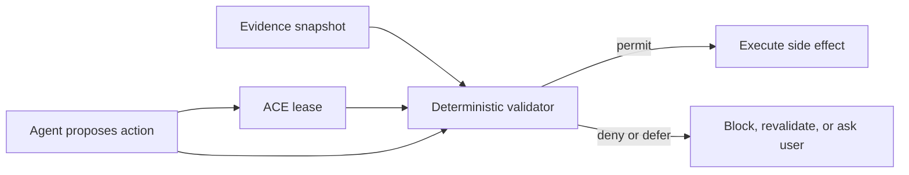

# ACE Runtime

Assumption-Carrying Execution (ACE) is a small runtime pattern for safer agents:
before an agent executes a side effect, the action must carry a lease describing
the assumptions and policies that still have to hold.

ACE is not an LLM provider, an agent framework, or a prompt template. It is a
deterministic pre-execution gate that can sit in front of tool calls, browser
actions, emails, purchases, deployments, workflow submissions, and other
side effects.

```text
Execute(action) only if Valid(action, lease, evidence) = permit
```

## Why This Exists

Agents often fail because they keep acting after the justification for an action
has gone stale: approval was revoked, scope changed, required evidence is
missing, a policy conflict appeared, or the action is no longer the exact action
that was approved.

ACE turns those hidden assumptions into explicit runtime contracts.

## Project Story

This project started from a simple observation: many dangerous agent failures
are not purely reasoning failures. The agent may produce a plausible action, but
the assumptions that justified that action have already changed.

The final public story is therefore narrow and concrete:

1. formalize the missing runtime primitive: an action lease over current evidence
2. build a deterministic validator for those leases
3. test it on a public policy benchmark where the validity conditions are explicit

## Quick Start

```bash
python -m venv .venv
source .venv/bin/activate
pip install -e ".[dev]"

ace-runtime demo
pytest
```

Validate the included sample lease:

```bash
ace-runtime validate \
  --lease examples/sample_lease.json \
  --evidence examples/sample_evidence_valid.json \
  --action examples/sample_action.json

ace-runtime validate \
  --lease examples/sample_lease.json \
  --evidence examples/sample_evidence_stale.json \
  --action examples/sample_action.json
```

Run the public-policy benchmark:

```bash
ace-runtime benchmark-stwebagentbench \
  --download-if-missing \
  --data data/stwebagentbench/test.raw.json \
  --output-dir results/stwebagentbench-ace-preflight
```

## Benchmark Result

The most credible included benchmark is derived from
[ST-WebAgentBench](https://github.com/segev-shlomov/ST-WebAgentBench), a public
web-agent safety and trustworthiness benchmark. The ACE benchmark compiles each
public policy row into two deterministic probes:

- one violating action that should be denied
- one compliant action that should be permitted

This is not the official browser leaderboard. It is an auditable pre-execution
policy benchmark built from public policy rows.

| pipeline | score | violation block | overblock |
|---|---:|---:|---:|
| execute-all baseline | 3,057 / 6,114 = 50.0% | 0.0% | 0.0% |
| keyword guard baseline | 3,772 / 6,114 = 61.7% | 23.4% | 0.0% |
| ACE preflight | 6,114 / 6,114 = 100.0% | 100.0% | 0.0% |

Public benchmark snapshot hash:

```text
31817831f963425bdc4d582936f2b9c0b9714fc986be7b4df67e50f2921e9a34
```

## Experiment Ladder

The project went through several experiment layers before arriving at the final
public benchmark:

- **theory motivation**: failures under stale assumptions or stale worldviews
- **tool-call validation**: runtime checking can improve exact execution
- **qualitative generated-artifact gating**: publish-time assumptions matter
- **public benchmark**: ST-WebAgentBench-derived policy preflight

Only the final public benchmark anchors the main claim. The rest are supporting
experiments and case studies.

## Architecture



The core package has three concepts:

- `Lease`: the action hash, approval state, expiry, policy context, and predicates.
- `Evidence`: structured facts about the current world.
- `validate_lease`: the deterministic checker that returns `permit`, `deny`, or `defer`.

## What ACE Guarantees

ACE gives a narrow safety guarantee:

If all side effects pass through the ACE gate, and the validator is sound for the
lease language, then ACE cannot increase invalid side-effect execution. It only
executes actions that pass the lease.

That is not the same as proving the world is true. ACE validates evidence, not
reality. Production deployments still need trusted evidence collection,
provenance, freshness, and tool isolation.

## Repository Guide

- `src/ace_runtime/lease.py`: core lease and predicate validator
- `src/ace_runtime/stwebagentbench.py`: public-policy preflight benchmark
- `examples/`: minimal sample action, lease, and evidence files
- `docs/SPEC.md`: lease language and validator semantics
- `docs/ARCHITECTURE.md`: integration patterns and diagrams
- `docs/BENCHMARKS.md`: benchmark methodology and results
- `docs/LIMITATIONS.md`: what this does not prove yet
- `site/`: static documentation website

## Documentation

The static documentation page is in `site/` and can be deployed on any static
host. It contains the project overview, benchmark numbers, architecture diagram,
and limitations.

## Limitations

ACE is useful when validity is checkable. It does not automatically solve:

- ambiguous policies that cannot be compiled into predicates
- false or stale evidence snapshots
- side-effect channels that bypass the gate
- model reasoning quality on tasks with no checkable action contract
- official browser-agent leaderboard performance

Use ACE as a runtime control boundary, not as a replacement for evaluation,
sandboxing, observability, or human approval.
