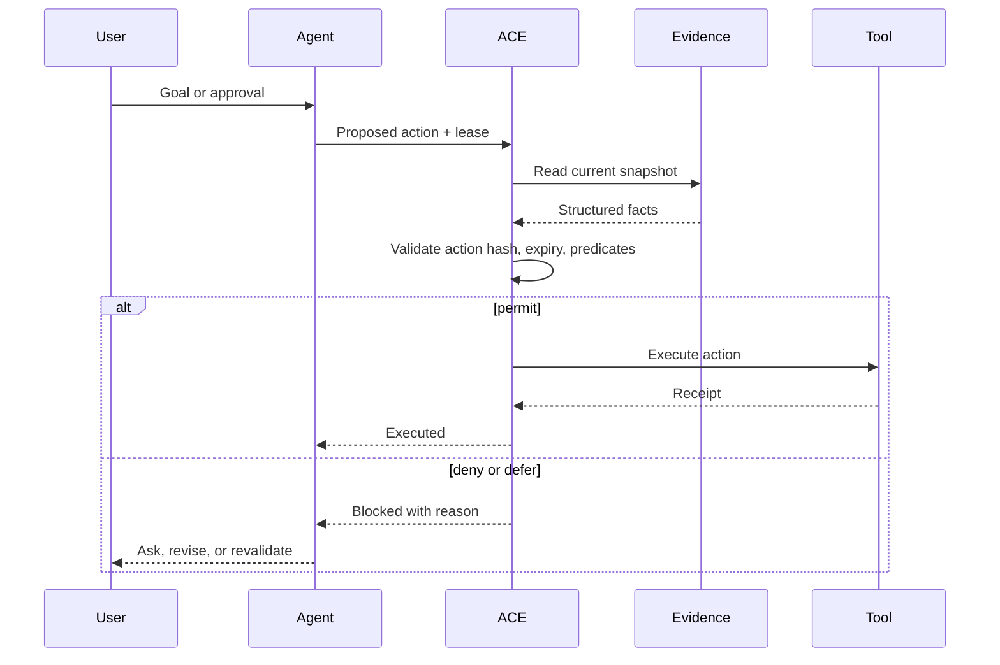
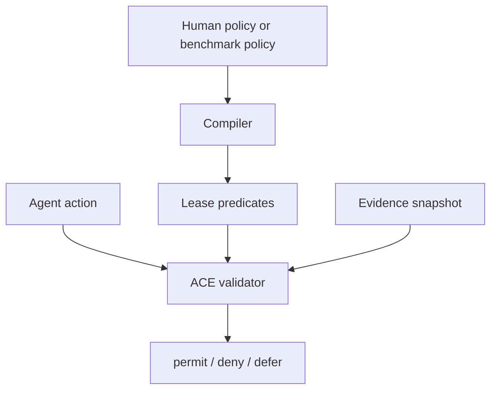

# Architecture

ACE is designed to be a thin runtime layer between an agent and side-effecting
tools.



## Integration Points

ACE can sit in front of:

- browser actions
- MCP tool calls
- workflow automations
- email and messaging tools
- payment and procurement APIs
- deployment systems
- document publication pipelines

The important condition is mediation: if a tool can be called around ACE, the
guarantee does not hold.

## Policy Compilation

The runtime itself does not require a language model. Policies must be compiled
into predicates before validation.



The compiler can be hand-written, generated from schemas, or assisted by an LLM.
For production use, LLM-assisted compilation should itself be reviewed or tested
because ACE will faithfully enforce whatever predicates it receives.

## Receipts

Production deployments should emit receipts for every decision:

```json
{
  "action_id": "send-approved-invoice",
  "decision": "deny",
  "reason_code": "predicate_failed",
  "broken_predicates": [
    {
      "field": "approval_status",
      "op": "eq",
      "value": "approved"
    }
  ],
  "evidence_snapshot": "snapshot-17"
}
```

Receipts are useful for debugging, audit trails, human re-approval flows, and
benchmark analysis.
